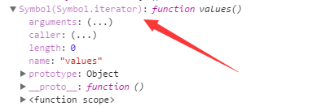

# Learn ES6

# 1 Iterator和for...of循环

## 1.1 Iterator (遍历器) 的基本概念

在 JS 中存在 数组(Array) 对象(Object) Map Set 四种存储数据的集合；并且为其提供一个统一的接口机制，来处理不同的数据结构，遍历器就是这样的一种接口，如果一种数据结构部署了遍历器，就意味着提供了一种统一的访问接口，可以遍历；
以数组为例：


Iterator 作用：
1. 为不同的数据结构提供相同的接口
2. 使数据结构内的成员以某种顺序排列
3. 配合 for...of 使用

## 1.2 Iterator 的遍历过程

1. 创建一个指针对象，指向当前数据的起始位置；
2. 调用next(),让这个指针指向下一个成员；
3. 不断地调用next(),直到指向最后的成员；

> 注：
> 每一调用next 都会返回一个对象，对象包含了当前项的值（value），以及一个代表是否完成的属性（done）；

模拟next：
```
function Iterator (array) {
    var nowIndex = 0;
    return {
        next: function () {
            return nowIndex < array.length ?
                {value: array[nowIndex++], done: false}:
                {value: undefined, done: true}
        }
    }
}

var arr = Iterator([1,2,3,4]);
console.log(arr.next()) // { value: 1, done: false }
console.log(arr.next()) // { value: 2, done: false }
console.log(arr.next()) // { value: 3, done: false }
console.log(arr.next()) // { value: 4, done: false }
console.log(arr.next()) // { value: undefined, done: true }
```

在ES6中，有些数据结构原生具备Iterator接口（比如数组），即不用任何处理，就可以被for...of循环遍历，有些就不行（比如对象）。原因在于，这些数据结构原生部署了Symbol.iterator属性（详见下文），另外一些数据结构没有。凡是部署了Symbol.iterator属性的数据结构，就称为部署了遍历器接口。调用这个接口，就会返回一个遍历器对象。

## 1.3 数据结构中默认的Iterator接口
[DOME2](././html/dome2.js)
1. 当使用for...of循环遍历某种数据结构时，该循环会自动去寻找Iterator接口。
2. 一种数据结构只要部署了Iterator接口，我们就称这种数据结构是”可遍历的“（iterable）。
3. ES6规定，默认的Iterator接口部署在数据结构的Symbol.iterator属中

在ES6 中存在默认的Iterator接口的有： Map 、 Set 、 数组 以及某些类数组的对象

```
var arr = [1,2,3,4,5,6,7];
for (val of arr) {
    console.log(val);
}
// 1 // 2 // 3 // 4 // 5 // 6 // 7
var obj = {
    1: 'a',
    2: 'b',
    length: 2
}
for (val of obj) {
    console.log(val);
}
// obj[Symbol.iterator] is not a function
```

对象（Object）之所以没有默认部署Iterator接口，是因为对象的哪个属性先遍历，哪个属性后遍历是不确定的，需要开发者手动指定。本质上，遍历器是一种线性处理，对于任何非线性的数据结构，部署遍历器接口，就等于部署一种线性转换。不过，严格地说，对象部署遍历器接口并不是很必要，因为这时对象实际上被当作Map结构使用，ES5没有Map结构，而ES6原生提供了。

对于类数组可以借用数组的 Symbol

```
var obj = {
    0: 'a',
    1: 'b',
    length: 2,
    [Symbol.iterator]: Array.prototype[Symbol.iterator]
}
for (val of obj) {
    console.log(val);
}
// a // b
```

如果Symbol.iterator方法对应的不是遍历器生成函数（即会返回一个遍历器对象），解释引擎将会报错。

```
var obj = {
    0: 'a',
    1: 'b',
    length: 2,
    [Symbol.iterator](){

    } //Cannot read property 'next' of undefined
}
for (val of obj) {
    console.log(val);
}
```

实现对象的Iterator 接口;
[DOME3](././html/dome3.js)

```
var arr = [1,2,3,4];
var obj = {
    name: 'ff',
    age: '24'
}
obj[Symbol.iterator] = function (){
    var self = this;
    var val = Object.keys(self);
    function next () {
        if (key = val.shift()) {
            return {
                value: self[key],
                done: false
            }
        } else {
            return {
                done: true
            }
        }
    };
    var iterator = {
        next: next
    };
    return iterator;
};

for (val of obj) {
    console.log(val);
}
```
注：这里的value 仅仅是存放for...of 中的val接受值，可以是任意想返回的值

## 1.4 调用Iterator接口的场合

1) for...of

```
var arr = [1,2,2,4,4,5,6];
for (val of arr) {
    console.log(val);
}
```

2) 解构赋值

```
var arr = [1,2,3,4,5]
let [a, ...b]  = arr;
console.log(a); // 1
console.log(b); // [ 2, 3, 4, 5 ]
```

3) 扩展运算符
```
var str = 'hello';
let [a] = str;
console.log(a); // h
console.log([...str]); // [ 'h', 'e', 'l', 'l', 'o' ]
console.log(['nihao', ...str]); // [ 'nihao', 'h', 'e', 'l', 'l', 'o' ]
```
实际上，这提供了一种简便机制，可以将任何部署了Iterator接口的数据结构，转为数组。也就是说，只要某个数据结构部署了Iterator接口，就可以对它使用扩展运算符，将其转为数组。

4) 其他

>for...of
Array.from()
Map(), Set(), WeakMap(), WeakSet()（比如new Map([['a',1],['b',2]])）
Promise.all()
Promise.race()
yield*

注： 只要修改了 Symbol Iterator 的value 就可以修改使用迭代器接口得到的内容；

## 1.5 for...of循环

ES6 借鉴 C++、Java、C# 和 Python 语言，引入了for...of循环，作为遍历所有数据结构的统一的方法。

一个数据结构只要部署了Symbol.iterator属性，就被视为具有iterator接口，就可以用for...of循环遍历它的成员。也就是说，for...of循环内部调用的是数据结构的Symbol.iterator方法。

for...of循环可以使用的范围包括数组、Set 和 Map 结构、某些类似数组的对象（比如arguments对象、DOM NodeList 对象）、后文的 Generator 对象，以及字符串。

>注：
1. arguments对象、DOM NodeList 对象 都部署了 Iterator 方法；
2. 并不是所有类似数组的对象都具有iterator接口，一个简便的解决方法，就是使用Array.from方法将其转为数组。

[DOME5](././html/dome5.js)

for...of 无法循环对象，但是配合Object.keys()就可以实现遍历对象
```
var person = {
    name: 'ff',
    age: '23',
    job: 'student'
}
for (val of Object.keys(person)) {
    val = person[val];
    console.log(val);
}
// ff // 23 // student
```

## 1.6 for...of for...in forEach

forEach:
1. 无法跳出循环，没有返回值

for...in:
1. 对于数组，键值为字符串‘0’....
2. for...in 会查找到原型链上，需要通过 hasOwnPropery
3. 有可能随机顺序进行遍历

for...of:
1. 可以配合continue、break、return 使用
2. 只要数据部署了 Iterator 就可以使用
