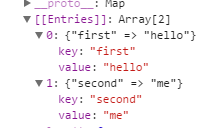

# LearnES6

# 变量的解构赋值
ES6允许按照一定模式，从数组和对象中提取值，对变量进行赋值，这被称为解构（Destructuring）。

## 1.1 数组的解构赋值
[dome1](././html/dome1.js)

### 1.1.1 数组解构赋值的简单运用
```
let [a, b, c] = [1,2,3];
console.log(a, b, c);
// 1 2 3
```
上面代码表示，可以从数组中提取值，按照对应位置，对变量赋值。这就是个解构赋值示例，相当于
```
let a = 1;
let b = 2;
let c = 3;
```
只要等号两侧能够满足一一对应的关系就可以进行完全解构，如果没有一一对应解构依然可以进行，只不过没有对应的值的变量会被赋予undefined

```
let [a, b, [c, d]] = [1, 2, [3, 4]];
console.log(a, b, c, d); // 1 2 3 4

let [,,one] = [1,2,4];
console.log(one); // 4

let [head, ...body] = [1,2,3,4,5];
console.log(head); // 1
console.log(body); // [ 2, 3, 4, 5 ]

let [x, y] = [1];
console.log(y); // undefined
```
需要注意的是：
1. 可以使用空的项站位
2. 可以在一个项前面使用'...'，这样会使用数组将剩余内容存储起来
3. 在数组的解构赋值中，如果等号右侧的不是数组（或者是说不可遍历的结构，那么就会报错）
```
// let [foo] = 1;
// let [foo] = NaN;
// let [foo] = undefined;
// let [foo] = null;
// let [foo] = {};
let [foo] = false;
console.log(foo); //undefined is not a function
```
4. 这里的`{}` 已经不代表代码块了，只是一个赋值语句;
5. 右侧可以是一个变量；

### 1.1.2 数组解构赋值--默认值
1) 在解构赋值的时候可以事先对变量设置默认值，如果一个变量接受了的值是个 undefined 的话就走默认值；

```
let [a = 'a', b = 'b'] = [1];
console.log(a, b); // 1  b
```

2) 默认值可以是一个表达式，那么就是一个惰性求值，只有在赋值失败的时候才会执行表达式；

```
function v () {
    console.log('已经执行了');
    return 'v';
}

let [a=v()] = [1];
console.log(a); // 1

let [ b = v() ] = [];
console.log(b);
// 已经执行了
// v
```

3) 默认值可以是引用解构赋值的其他变量，但是该变量必须是已经声明了的

```
let [head = foot; foot] = [];
// 这里的foot在赋给head之前不能使用所以报错, 即使使用var也是一样
console.log(head, foot); // Unexpected token ;
```

### 1.2 对象的解构赋值
[dome2](././html/dome2.js)

解构不仅仅适用于数组还可以适用于对象，但是数组的元素是按次序排列的，变量的取值由它的位置决定；而对象的属性没有次序，变量必须与属性同名，才能取到正确的值。

```
let {name, age, gender} = {name: 'ff', age: 24};
console.log(name, age, gender); // ff  24 undefined
```

1) 变量名和属性名不相同

有时我们可能会需要创建一个变量去接受一个对象中的某个值，这是我们并不能保证我们创建的变量名和我们希望接受的属性名是相同的：
```
let {who} = {name:'ff'}
console.log(who); // undefined
```
如果是希望 who 去接受 name 显然是不行的;

我们可以这样解决：

```
let {name:who} = {name:'ff'}
console.log(who); // ff
```

这同时也说明了：
`let {name, age, gender} = {name: 'ff', age: 24};`
是`let {name:name, age:age, gender:gender} = {name: 'ff', age: 24};`的简写形式

也就是说，对象的解构赋值的内部机制，是先找到同名属性，然后再赋给对应的变量。真正被赋值的是后者，而不是前者。

```
let {name:who} = {name:'ff'}
console.log(who); // ff
console.log(name); // error: name is not defined
```

2) 赋值已经声明的变量；

如果细心的可以发现，如果对象的解构赋值是先声明在赋值的话会报错：
```
let a;
[a] = [1] // a = 1
let name;
{name} = {name:'ff'} //Unexpected token =
```
因为解析器会将起首的大括号，理解成一个代码块，而不是赋值语句。
这时就会需要换一种写法：
```
let name;
({name} = {name: 'ff'})
console.log(name); // ff
```

3) 嵌套对象的解构赋值

和数组一样，解构也可以用于嵌套结构的对象。

```
let obj = {
    person: {
        name:'ff',
        friend: ['小明', '小红']
    }
}

let {person:{name, friend:[a, b]}} = obj;
console.log(name, a, b); // ff '小明' '小红'
```

需要注意的是，这里的 person 是指模式，不是变量，不会被赋值；

4) 对象的解构赋值同样可以设置默认值
```
let {name='ff', age='24'} = {age: 11};
console.log(name, age); // ff 11
```
和数组的规则一样，不多叙述

5）其它

1. 如果解构模式是嵌套的对象，而且子对象所在的父属性不存在，那么将会报错。
```
var {foo: {bar}} = {baz: 'baz'};
//Cannot match against 'undefined' or 'null'.
```
解释：
foo没有得到赋值，所以foo->undefined ，再去看bar 就是 undefined.bar 就报错了

2. 对象的解构赋值，可以很方便地将现有对象的方法，赋值到某个变量。
```
let { log, sin, cos, "PI":pi } = Math;
console.log(sin); // [Function: sin]
console.log(sin(60*pi/180)); //0.8660254037844386
```

3. 由于数组本质是特殊的对象，因此可以对数组进行对象属性的解构。
```
let arr = [1,2,3];
let {0: first, [arr.length-1]: last} = arr;
console.log(first, last); // 1 3
```
但是对对象不能使用数组解析：
`let arr [a, b, c] = {0: 'first', length: 1}`
//  Unexpected token {

### 1.3 字符串的解构赋值
[DOME3](././html/dome3.js)
字符串作为一个类似数组的对象进行解构赋值。
```
let [a,b,c,d,e] = 'hello';
console.log(a, b, c, d, e); //h e l l o
```
并且可以将字符串的 length 属性也从通过对象的解构方式提取出来；
```
let [a,b,c,d,e] = 'hello';
console.log(a, b, c, d, e); //h e l l o
let{length} = 'helloworld';
console.log(length); 10
```

### 1.4 数值和布尔值的解构解析

解构赋值时，如果等号右边是数值和布尔值，则会先转为对象，在对其进行解构，这样就可以获得其上的方法和属性;
```
let {toString: t} = true;
console.log(t); // [Function: toString]

let {toString: n} = 1234;
console.log(n); // [Function: toString]
```
解构赋值的规则是，只要等号右边的值不是对象，就先将其转为对象。由于undefined和null无法转为对象，所以对它们进行解构赋值，都会报错。

ps: 不知道有什么用

### 1.5 函数参数的解构解析
[DOME5](././html/dome5.js)
```
function ex ([x, y]) {
    console.log(x, y); // 1 2
};
ex([1,2])
```

函数解构的时候也可以使用默认值

```
function ex ([x=1, y=2]) {
    console.log(x, y); // 3 , 2
}
ex([3])
```
同样的，如果转入的是一个undefined 那么就会使用默认值

在使用对象的时候就需要注意了：
如果是：
```
function ex ({x=1, y=2}) {
    console.log(x, y);
}
ex()
```
就会报错，是由于没有遇见 ‘=’ 所以不能判断这个对象是一个解构解析的表达式，就不能使用x，y
所以应该使用：

```
function ex ({x=2, y = 4} = {}) {
    console.log(x , y); // a 4
}

ex({x:'a'})
```
这里值得注意的是，在'{x=2, y = 4} = {}'中右侧的仅仅是个形式，当传入参数的时候就是这样解析的：
{x=2, y = 4} = {x: 'a'}

### 1.6 圆括号的问题
[DOME6](././html/dome6.js)
解构赋值虽然很方便，但是解析起来并不容易。对于编译器来说，一个式子到底是模式，还是表达式，没有办法从一开始就知道，必须解析到（或解析不到）等号才能知道。

由此带来的问题是，如果模式中出现圆括号怎么处理。ES6的规则是，只要有可能导致解构的歧义，就不得使用圆括号。

但是，这条规则实际上不那么容易辨别，处理起来相当麻烦。因此，建议只要有可能，就不要在模式中放置圆括号。

可以使用圆括号的情况只有一种：赋值语句的非模式部分，可以使用圆括号。

```
// let{p:(b)} = {p:123}; // 变量声明中不能带括号，因为模块不能使用括号
// console.log(b);
({p:(b)} = {p:123}); // p 也是模块，所以p不能被括号包裹
console.log(1);
console.log(b); // 123
```
由于这种情况不常见，所以仅仅做了了解

## 1.7 结构赋值的用途

[DOME7](././html/dome7.js)

### 1.7.1 变换变量的值；

```
let [x, y] = [1, 'a'];
console.log(x, y); // 1 a
([x,y] = [y,x])
console.log(x, y); // a 1
```
### 1.7.2 从函数返回多个值
函数只能返回一个值，如果要返回多个值，只能将它们放在数组或对象里返回。有了解构赋值，取出这些值就非常方便。
```
function getPerson () {
    return {
        name: 'ff',
        age: 24
    }
};

let{name: personName,age: personAge } = getPerson()
console.log(personName,personAge); // ff 24
```

### 1.7.3 函数参数的定义

解构赋值可以方便地将一组参数与变量名对应起来。

```
function setMe ({name, age} = {}) {
    console.log(name, age); // ff 24
}
setMe({age:24, name: 'ff'});
```

### 1.7.4 提取JSON数据

解构赋值对提取JSON对象中的数据，尤其有用。
```
var data = {
    id: 1,
    pid: 0,
    name: 'ff',
    age: '24'
}
var {name: who} = data
console.log(who); // ff
```

### 1.7.5 函数参数的默认值
```
function showMe ({name = 'ff', age=24}={}) {
    console.log(name+ '想成为' + age + '岁');
}

showMe() // ff想成为24岁
showMe({undefined, age:11}) //ff想成为11岁
```

### 1.7.6 遍历Map结构
[DOME](././html/dome.html)
任何部署了Iterator接口的对象，都可以用for...of循环遍历。Map结构原生支持Iterator接口，配合变量的解构赋值，获取键名和键值就非常方便。

```
<script>
    var map = new Map();
    map.set('first', 'hello');
    map.set('second', 'me');
    console.log(map); // { 'first' => 'hello', 'second' => 'me' }
    for (let [key, value] of map) {
        console.log(key); // first | second
    }
</script>
```


### 1.7.7 取出模块的指定方法

加载模块时，往往需要指定输入那些方法。解构赋值使得输入语句非常清晰。

`const { SourceMapConsumer, SourceNode } = require("source-map");`
