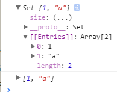

# LearnES6

# 数组的扩展

## 1.1 Array.from()

`Array.from(arrayLike: ?, mapFn?: fn(elt: ?, i: number), thisArg?: ?)`

[DOME1](././html/dome1.js)

用于将一个类数组或者是一个可遍历（iterable）的对象转换成正真的数组

```
let arrayLike = {
    0: 'a',
    1: 'b',
    2: 'c',
    length: 3
};

let newArr = Array.from(arrayLike);
console.log(newArr); // [ 'a', 'b', 'c' ]
```
注： 如果在E5中可以使用：

```
var arrLike = {
    0: 'a',
    1: 'b',
    2: 'c',
    length: 3
}

var newArr = [].slice.call(arrLike);
console.log(newArr); // [ 'a', 'b', 'c' ]

var newArr = Array.prototype.slice.call(arrLike);
console.log(newArr); // [ 'a', 'b', 'c' ]
```

第二个参数

Array.from还可以接受第二个参数，作用类似于数组的map方法，用来对每个元素进行处理，将处理后的值放入返回的数组

```
var arrLike = {
    0: 'a',
    1: 'b',
    2: 'c',
    length: 3
}

var newArr = Array.from(arrLike, function(e){
    return e + 'e';
})
console.log(newArr); // [ 'ae', 'be', 'ce' ]
```

### 1.1.2 Array.from() 的扩展运用

Array.from 用于将类数组转换成为 真正的数组，在js中常见得类数组有： NodeList 和 arguments；

1） NodeList:
[HTML](././html/dome1.html)

```
var arrLike = document.querySelectorAll('li');
var newArr = Array.from(arrLike);
console.log(newArr);
newArr.forEach(function (e, i){
    e.style.background = 'red'
})
```

2） arguments
[DOME1](././html/dome1.js)
```
function fn () {
    console.log(arguments); // { '0': 1, '1': 2, '2': 3, '3': 4, '4': 5 }
    console.log(Array.from(arguments)); // [ 1, 2, 3, 4, 5 ]
}
fn(1, 2, 3, 4, 5)
```

3） 字符串

```
var str  = 'hello';
console.log(Array.from(str)); //[ 'h', 'e', 'l', 'l', 'o' ]
```

4）Set

[HTML](././html/dome1.html)
```
var arrLike1 = new Set([1,'a']);
console.log(arrLike1);
var newArr1 = Array.from(arrLike1);
console.log(newArr1);
```


上面代码中，字符串和Set结构都具有Iterator接口，因此可以被Array.from转为真正的数组。

5） 取出节点内容

```
var arrLike = document.querySelectorAll('li');
var getCon =  Array.from(arrLike, function(e) {
    return e.innerHTML;
});

console.log(getCon); // ["01", "02", "03", "04", "05", "06", "07", "08", "09", "10"]
```

6）Array.from()的另一个应用是，将字符串转为数组，然后返回字符串的长度。因为它能正确处理各种Unicode字符，可以避免JavaScript将大于\\uFFFF的Unicode字符，算作两个字符的bug。

7） Array.from的第一个参数指定了第二个参数运行的次数。这种特性可以让该方法的用法变得非常灵活。

```
console.log(1);
var newArr = Array.from({ length: 2 }, () => 'jack')
console.log(newArr); // [ 'jack', 'jack' ]
```

### 1.1.3 扩展运算符（...）
值得提醒的是，扩展运算符（...）也可以将某些数据结构转为数组。

[HTML2](././html/dome2.html)

```
var arrLike = document.querySelectorAll('li');
var newArr = [...arrLike];
console.log(newArr); // [li, li, li, li, li, li, li, li, li, li]
newArr.forEach(function (e, i){
    e.style.background = 'red'
});

var arrLike1 = new Set([1,'a']);
console.log(arrLike1); // Set {1, "a"}
var newArr1 = [...arrLike1];
console.log(newArr1); // [1, "a"]
```

扩展运算符背后调用的是遍历器接口（Symbol.iterator），如果一个对象没有部署这个接口，就无法转换。Array.from方法则是还支持类似数组的对象。所谓类似数组的对象，本质特征只有一点，即必须有length属性。因此，任何有length属性的对象，都可以通过Array.from方法转为数组，而此时扩展运算符就无法转换。


## 1.2 Array.of()

用于将一组值，转换成数组
```
let arr1 = new Array(4);
console.log(arr1); // [, , , ]
let arr2 = Array.of(4);
console.log(arr2); // [4]
```

Array.of() 主要是用于解决，在字面量声明数组时，如果只传一个数字参数，那么这个数字参数会被认为是数组的长度

## 1.3 数组实例的copyWithin方法

数组实例的copyWithin方法，在当前数组内部，将指定位置的成员复制到其他位置（会覆盖原有成员），然后返回当前数组。也就是说，使用这个方法，会修改当前数组。

`Array.prototype.copyWithin(target, start = 0, end = this.length)`

```
[1, 2, 3, 4, 5].copyWithin(0, 3)
// [4, 5, 3, 4, 5]
```

上面代码表示将从3号位直到数组结束的成员（4和5），复制到从0号位开始的位置，结果覆盖了原来的1和2。
不知道干什么用，暂不叙述

## 1.4 数组实例的find()和findIndex()

数组实例的find方法，用于找出第一个符合条件的数组成员。它的参数是一个回调函数，所有数组成员依次执行该回调函数，直到找出第一个返回值为true的成员，然后返回该成员。如果没有符合条件的成员，则返回undefined。

```
let arr3 = [1,2,3,4,5,6];
var newArr = arr3.find(function (value, index, arr) {
    console.log(value);
    console.log(index);
    console.log(arr);
    return value > 4
})
console.log(newArr);
```

数组实例的findIndex方法的用法与find方法非常类似，返回第一个符合条件的数组成员的位置，如果所有成员都不符合条件，则返回-1。

```
let arr4 = [1,2,3,4,5,6];
var newArr = arr4.findIndex(function (value, index, arr) {
    // console.log(value);
    // console.log(index);
    // console.log(arr);
    return value > 4
})

console.log(newArr); // 4
```

另外，这两个方法都可以发现NaN，弥补了数组的IndexOf方法的不足。
上面代码中，indexOf方法无法识别数组的NaN成员，但是findIndex方法可以借助Object.is方法做到。


## 1.5 数组实例的fill()

```
var arr =  new Array(4);
arr.fill('a') // [ 'a', 'a', 'a', 'a' ]
console.log(arr);
```

## 1.6 entries()，keys()和values()

用于遍历数组 , values 使用失败

```

var arr = ['a', 'b', 'c'];
// for (let key of arr.keys()) {
//     console.log(key); // 0 1 2
// }

// for (let val of arr.entries()) {
//     console.log(val); //[ 0, 'a' ] [ 1, 'b' ] [ 2, 'c' ]
// }

for (let [key, val] of arr.entries()) {
    console.log(key);
    console.log(val);
}
// 0
// a
// 1
// b
// 2
// c
```

## 1.7 数组实例的includes()

Array.prototype.includes方法返回一个布尔值，表示某个数组是否包含给定的值，与字符串的includes方法类似。该方法属于ES7，但Babel转码器已经支持。

```
var arr = [1,2,3,'a','ac','b'];
console.log(arr.includes('a')); // true
```
该方法的第二个参数表示搜索的起始位置，默认为0。如果第二个参数为负数，则表示倒数的位置，如果这时它大于数组长度（比如第二个参数为-4，但数组长度为3），则会重置为从0开始。

```
var arr1 = [1,1,1,1,1,1,1,1]
console.log(arr1.includes(1, 4, 5)); // false
```

indexOf方法有两个缺点，
一是不够语义化，它的含义是找到参数值的第一个出现位置，所以要去比较是否不等于-1，表达起来不够直观。
二是，它内部使用严格相当运算符（===）进行判断，这会导致对NaN的误判。

>另外，Map和Set数据结构有一个has方法，需要注意与includes区分。
Map结构的has方法，是用来查找键名的，比如Map.prototype.has(key)、WeakMap.prototype.has(key)、Reflect.has(target, propertyKey)。
Set结构的has方法，是用来查找值的，比如Set.prototype.has(value)、WeakSet.prototype.has(value)。

## 1.8 数组的空位

```
var arr = new Array (6);
console.log(arr); //[ , , , , ,  ]
var newArr = Array.from(arr);
console.log(newArr);//[ undefined, undefined, undefined, undefined, undefined, undefined ]
```

ES6则是明确将空位转为undefined。
